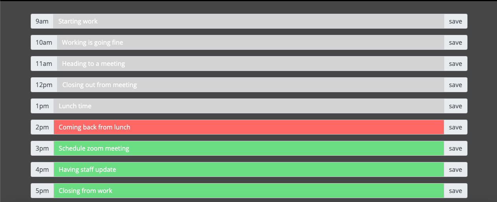

# Work-Day-Schedule

This is a calendar application that allows the user to save events for each hour of the day. When user open the planner, the current day is displayed at the top of the calendar. Below is the timeblocks for standard business hours and each timeblock is color coded to indicate the past, present, or future. When the user enter an event and click the save button for that timeblock, the text for that event is saved in the local storage. When the page is refreshed, the saved events persist.

## Screen Shot

## Screen Shot

## Screen Shot

### Video

  
